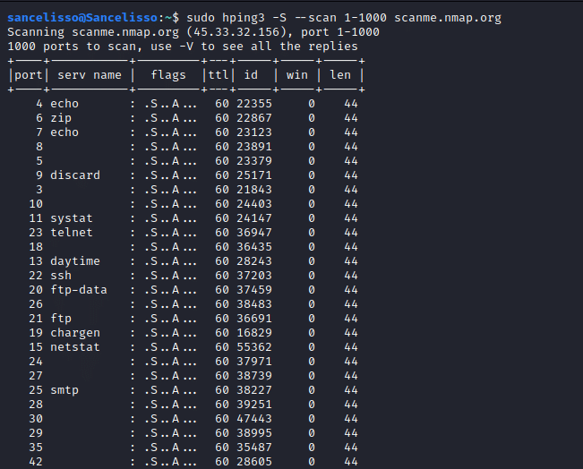

	
Read Time:3 Minute, 11 Second

Installé de base sur kali, sert à la découverte réseau, le flood, l’envoi de paquet avec adresses IP aléatoires, l’audit de pile TCP/IP, la bypass de parefeu, découverte de path MTU, et beaucoup d’autre chose. Il n’a presque rien à envier à Nmap hormis peut-être les scripts NSE.

Aujourd'hui, on vous le présente pour mettre en avant cette pépite cachée de Kali :)


# [](#header-1)On scanne !

Hping3, au vu du protocole utilisé, à besoin d’une élévation de privilège. Donc pensez à sudo ou sudo su.

```console
lazyadmin@kali:~$ hping3 -S --scan 1-1500 example.com
```



On peut voir que l'output du scan de Hping3 est vraiment bien organisé, simple et facile à lire, de plus Hping3 est très rapide par rapport à NMAP. Hping3 est donc un bon moyen de start une target de manière rapide avant de rentrer en profondeur avec NMAP.

Vous pouvez utiliser `all` pour scanner tout les ports

```console
lazyadmin@kali:~$ hping3 -S --scan all example.com
```

Mémo : Pour les intervalles c'est toujours avec des tirets (ex: 1-1500 -> de 1 à 1500)
       Pour séparer les ports c'est toujours avec des virgules (ex: 80,443,8080)
